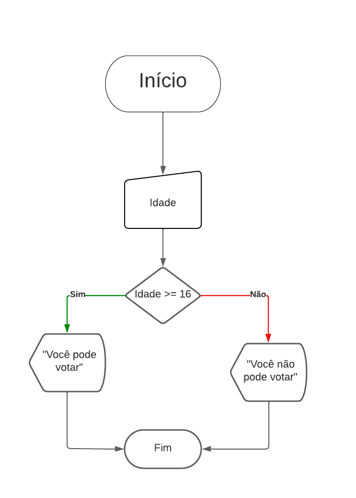
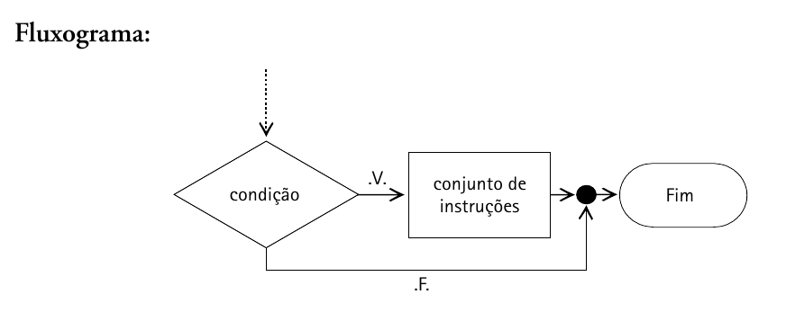
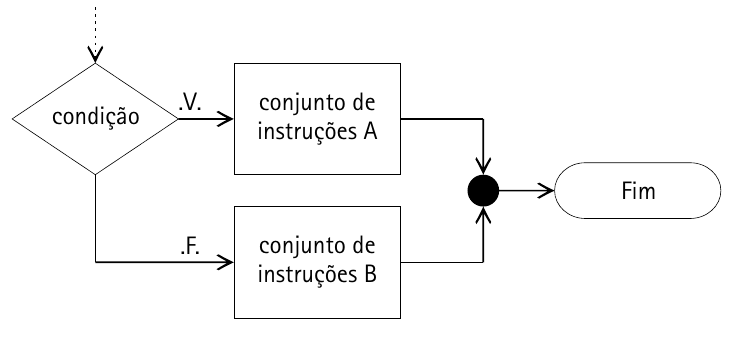
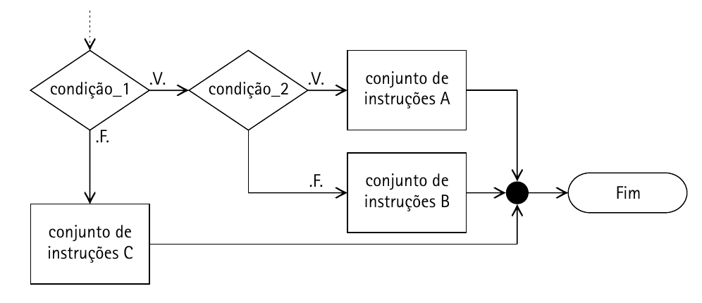
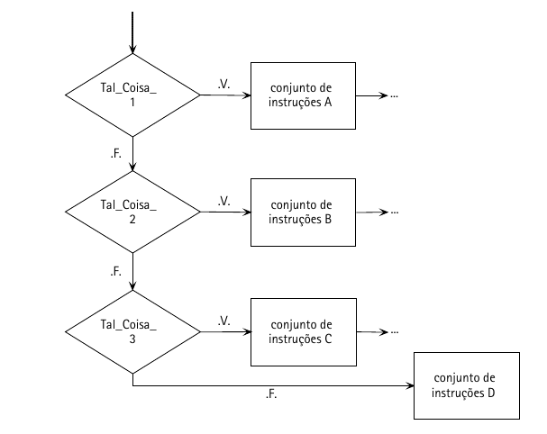

# Condicionais na Lógica

No mundo da programação, existem estruturas que modificam a forma como o programa é executado baseando-se em condições especificadas. O objetivo disso é justamente prever entradas do usuário e modificar o comportamento do programa.
 
Normalmente, todo programa é lido e executado da esquerda para a direita, de cima para baixo, isto é chamado de estrutura sequencial. Porém com as chamadas estruturas de controle é possível alterar o fluxo de execução, bifurcando, dividindo os caminhos que o seu algoritmo pode tomar. Neste caso será estudada as condicionais.

As condicionais são estruturas de controle que, tomando como partida uma condição verdadeira (estas condições são baseadas nos operadores lógicos e relacionais já explicados), executa uma série de instruções. 
Nesse sentido. um exemplo simples e cotidiano são as condições de voto no Brasil. Se o eleitor for maior ou possuir 18 anos, vota obrigatoriamente; nesse contexto, se for analfabeto, o seu voto é facultativo; se o eleitor estiver com idade entre 16 e 18 ou acima de 70 anos, também é facultativo; se não for verdadeiro nada disso, significa que é menor do que 16 anos, criança, com voto proibido. Um exemplo de fluxograma simples abaixo.


Exemplo de condicional no fluxograma, sendo que o losango representa a condicional

Outro exemplo é um jogo. Imagine um jogo RPG onde você pode tomar escolhas e baseadas nessas escolhas, passar ou não de fase. Suponha-se que a condição de vitória seja o jogador atingir 100 pontos e ele passar por alguns nessa fase, por exemplo, lidar com um vendedor, lutar com um bandido e falar com o rei da cidade. Para cada um dos casos ele vai ter uma escolha para fazer e baseada nessas escolhas ele pode ganhar pontos ou perdê-los. Se não conseguir a quantidade de pontos necessária, o jogo vai exibir que ele deve tentar novamente.

Percebe-se que, de acordo com as escolhas do usuário, o programa pode ter diferentes saídas. Para isso, existe essas estruturas de decisão, cujos tipos são If, If-else, If-else + Else If e Switch Case

## Tipos de condicionais em Java

Esses são os principais tipos de condicionais no Java: If, If-else, If-else + Else If, Condicionais Encadeadas e Switch Case.

### If

A condição if pura é a mais simples, caso a condição seja verdadeira, executa um bloco de código, se não, segue o fluxo normalmente.

#### Estrutura:

##### Fluxograma: 


Fonte Livro Lógica de Programação autora Sandra
##### Código
```java
    if(condicao){
        <instruções>
    }

```

Exemplo:

```java
    ...
    final double valorProduto = 200;
    double desconto = 0;
    String formaPgmto = "cartao";
    if (formaPgmto.equals("pix")){
        desconto = 1/100;
    }
    //Segue o fluxo
    double valorFinal = valorDoProduto - (valorDoProduto*desconto)
```
No exemplo acima, tem-se um programa em que se é calculado um desconto de 1% sobre o valor de um produto se o pagamento for em pix. Caso não seja, continua o mesmo valor. Não é necessário explicitar o senão (else) aqui, pois o valor final será calculado independente da condição ser verdadeira.

### If Else

Já uma estrutura if else existem dois caminhos a serem tomados. Caso a condição seja verdadeira, vai realizar instruções especificadas, se não, vai realizar outras instruções.

####Estrutura:

##### Fluxograma


##### Código
```java
    //Se for verdade
    if(condicao){
		<conjDeInstruções>
    }
    //Se não for:
    else{
		<conjDeInstruções>
    }
```

Exemplo:

```java
    
    String nome = "Zulmira";
    int idade = 8;
    //Se for verdadeiro
    if(idade>18){
        ...println("Maior de idade");
    }    
    //Se não for verdade
    else{
        ...println("Menor de idade");
    }

```
No exemplo acima, verifica se a idade da pessoa é maior do que 18. Se sim, vai exibir que ela é maior de idade; se não, exibirá que ela é de menor.

### If Else + Else if

Esse tipo de condicional faz parte das condicionais de múltipla escolha, em que se pode atribuir mais de uma condição para atingir diferentes saídas no seu programa. Para se ler uma instrução desse tipo, ocorre assim: "Se for verdade, faça isso; se não, se outra condição for verdade, faça algo a mais; se não, faça outra coisa." Na realidade, esse tipo de condicional é um else que possui um if dentro (ao fazer isso, obtém se o mesmo resultado do que com else if), porém se criou o "else if" para que não haja tanta identação no código. Voltando ao problema da votação no Brasil, podemos utilizar essa condicional para solucionar o problema. Antes, será mostrado sua estrutura como nos tópicos anteriores.

#### Estrutura: 

##### Fluxograma

##### Código
```java
    if(condicao01){
        faça
    }
    else if(condicao02){
        faça outra coisa
    }
    else{
        faça alguma outra coisa
    }

```

Exemplo:

```java
    int idade = 19;
    if(idade<16){
        ...println("Voto Proibido");
    }
    else if (idade >= 16 && idade < 18){
        ...println("Voto facultativo");
    }
    else if (idade>70){
        ...println("Voto facultativo");
    }
    else{
        ...println("Voto obrigatório");
    }

```

Vale ressaltar que os "else if" podem ser utilizados quantas vezes quiser para estender as condicionais, como utilizado no exemplo acima. Nesse caso não seria necessário eu colocar mais um "else if" onde se tem relacionado a voto facultativo, pois é possível enquadrar ambos casos com os operadores lógicos, porém eu fiz isso para que eu pudesse demonstrar que se pode colocar mais de uma dessas condicionais.

### Condicionais Encadeadas

Esse tipo de condicional é aquele em que, verificando se uma condição como verdadeira, realiza outros testes condicionais dentro da estrutura de decisão. Um exemplo é em um jogo de escolha: imagine que você tem inicialmente duas escolhas no jogo, você pode ir para a praia ou para o clube de piscina. Se você escolher ir para a praia, se escolher trazer o guarda-sol, não se machucará com o Sol, porém, se não escolher, acabará se machucando. Veja o exemplo a seguir.

#### Estrutura:

##### Fluxograma



##### Código

```
if(condicao){
	<instruções>(opcional)
	if(condicao02){
		<instruções>
	}
	else{
		<instruções>
	}
}
else{

}
```

Exemplo:

```
...println("Escolha praia ou sol")
	String opcaoLocal = input.nextLine();
	boolean opPraia = opcaoLocal.equalsIgnoreCase("praia")
	if(opPraia){
		...println("Val levar guarda-Sol?")
		String levarGuardaSol = input.nextLine();
		boolean levouGuardaSol = levarGuardaSol.equalsIgnoreCase("sim");
		if(levouGuardaSol) {
			...println("Parábens, você ficou na praia, se divertiu e não se machucou com o Sol");
		}
		else{
			...println("Que pena, por você não ter levado guarda-Sol, dado a temperatura do Dia você acabou se machucando com os raios solares na praia. Agora está tudo ardendo, mas valeu a pena.")
		}
	}
	else{
		...println("Você foi ao clube da piscina e se divertiu bastante.")
	}
```

### Switch Case

Mais uma condicional de múltipla escolha, é a mais aconselhável para criar condições de seleção. Muito útil quando é preciso selecionar alguma opção para executar alguma função no programa. Ou exibir algum dado baseado em algum catálogo, exemplo = 01: metais, 02: inflamáveis, 03: fios e eletricidade, etc.

####Estrutura:

##### Fluxograma



##### Código
```java
    switch(variavel){
        case '01':
            faça algo 01;
            break;
        case '02':
            faça algo 02;
            break;
        case '03':
            faça algo 03;
            break;
        default:
            faça algo 04;
            break
    }
```

Exemplo: 

```java
    int indice = input.nextInt();
    switch (indice){
        case 0:
            ...println("Metais");
            break;
        case 1:
            ...println("Inflamáveis");
            break;
        case 2:
            ...println("Fios e eletricidade");
            break;
        default:
            ...println("Diversos");
    }

```
